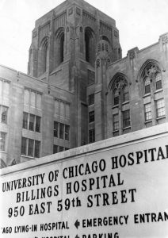

# Exploratory data analysis using Python

__Exploratory Data Analysis(EDA)__ includes __cleaning__, __munging__, __combining__, __reshaping__, __slicing__, __dicing__, and __transforming data__ for analysis purpose.

 __Exploratory Data Analysis__
Understand the data by EDA and derive simple models with Pandas as baseline.
EDA ia a critical and first step in analyzing the data and we do this for below reasons :
    - Finding patterns in Data
    - Determining relationships in Data
    - Checking of assumptions
    - Preliminary selection of appropriate models
    - Detection of mistakes 

# Project Details
## Breast Cancer Survival

## Introduction
The dataset contains cases from a study that was conducted between __1958 and 1970__ at __the University of Chicago's Billings Hospital__ on the survival of patients who had undergone __surgery for breast cancer__.

## Data Overview

Here in the dataset, each row represents a patient, each column contains patient's attributes.

| Column Name | Description |
| --- | --- |
| Age | Numerical Value |
| Patient's year of operation | (year - 1900, numerical) |
| Number of positive axillary nodes detected | Numerical Value |
| Survival status (class attribute) | (1 = the patient survived 5 years or longer, 2 = the patient died within 5 year)

## Data Insights

This is what we analysed after feature engineering:

- Of total,73% patients survived. 
- If we consider the age of patients then middle age group with age 40-65 years are more prone to this disease.
- Broadly, young age group(age less than 40) has better survival rate ie. 90% and young age with less tan 10 positive axillary nodes has survival rate of 92%.
- Almost 87% patients have less than 10 positive axillary nodes.
- With axillary nodes less than 10,the survival rate is 78% but for nodes greater than 10 the survival rate is 42%.
- Maximum nodes found in patient is 52.
- 44% patients have 0 axillary nodes and survival rate with 0 axillary nodes is 86%.
- Years 1958 reported the maximum number of operations.
- The patients operated after 1965 have slightly higher rate of survival than patinets operated before 1960 (Difference in rate of survival is 6%).

